The Spaceship Titanic Incident
================
Darren Wong
2022-04-01

-   [1 Introduction](#1-introduction)
-   [2 Exploratory Data Analysis](#2-exploratory-data-analysis)
    -   [2.1 Categorical variables &
        booleans](#21-categorical-variables--booleans)
    -   [2.2 Numerical variables](#22-numerical-variables)
-   [3 Feature Importance](#3-feature-importance)
    -   [3.1 Mutual information](#31-mutual-information)
    -   [3.2 Weight of evidence](#32-weight-of-evidence)
-   [4 Missing/NAs](#4-missingnas)
    -   [4.1 `CryoSleep`](#41-cryosleep)
    -   [4.2 Luxury amenities](#42-luxury-amenities)
    -   [4.3 `HomePlanet`](#43-homeplanet)
    -   [4.4 `Deck`](#44-deck)
    -   [4.5 Final roll-up](#45-final-roll-up)
-   [5 Training](#5-training)
    -   [5.1 Splitting into train/validation/test
        sets](#51-splitting-into-trainvalidationtest-sets)
    -   [5.2 Random Forest](#52-random-forest)
    -   [5.3 XGBoost](#53-xgboost)
-   [6 Prediction](#6-prediction)

# 1 Introduction

This is my first Kaggle submission, as well as one of my first forays
into machine learning. In this report I’ll be tackling the binary
classification problem of determining whether a passenger on the
Spaceship Titanic has been inadvertently and unfortunately teleported to
an alternate dimension. This write-up will be structured in the
following general way:

-   Exploratory data analysis (EDA)
-   Feature importance using mutual information and weight of
    information/information value
-   Imputation and prediction of missing values using the `mice` package
-   Model training and validation using random forests
-   Final prediction for the test set provided by Kaggle

Before we begin, some links and setup code:

-   This write-up is inspired by the excellent report written by
    Megan L. Risdal: [Exploring Survival on the
    Titanic](https://www.kaggle.com/code/mrisdal/exploring-survival-on-the-titanic/report)
-   [Kaggle competition
    link](https://www.kaggle.com/competitions/spaceship-titanic/overview)

``` r
library(tidyverse)    # Data manipulation and cleaning
library(data.table)   # Same as above & utilities for loading/saving csvs
library(ggplot2)      # Charting
library(scales)       # Prettier printing of values in charts
library(gridExtra)    # Arrange multiple ggplot2 plots on one chart
library(infotheo)     # Mutual information
library(Information)  # Weight of evidence/information value
library(mice)         # Missing value prediction
library(randomForest) # Random forests
library(caret)        # Confusion matrices & grid search
library(xgboost)      # XGBoost ML model

# Set working directory
if (.Platform$OS.type == "windows") {
  setwd('E:/Projects/kaggle-analyses/spaceship-titanic') # PC
} else {
  setwd('~/Documents/Projects/kaggle/spaceship-titanic') # Macbook
}
```

We can now load the data-sets that Kaggle provides us and then bind them
together.

``` r
train <- fread('raw-data/train.csv') %>% as_tibble()
test  <- fread('raw-data/test.csv') %>% as_tibble()

all   <- bind_rows(
  train %>% mutate(dataset = 'train'),
  test %>% mutate(dataset = 'test')
) 
```

# 2 Exploratory Data Analysis

Some quick glimpses at the data to get a sense of what we’re working
with:

``` r
# We have 15 variables and 12,970 observations
glimpse(all)
```

    ## Rows: 12,970
    ## Columns: 15
    ## $ PassengerId  <chr> "0001_01", "0002_01", "0003_01", "0003_02", "0004_01", "0~
    ## $ HomePlanet   <chr> "Europa", "Earth", "Europa", "Europa", "Earth", "Earth", ~
    ## $ CryoSleep    <lgl> FALSE, FALSE, FALSE, FALSE, FALSE, FALSE, FALSE, TRUE, FA~
    ## $ Cabin        <chr> "B/0/P", "F/0/S", "A/0/S", "A/0/S", "F/1/S", "F/0/P", "F/~
    ## $ Destination  <chr> "TRAPPIST-1e", "TRAPPIST-1e", "TRAPPIST-1e", "TRAPPIST-1e~
    ## $ Age          <dbl> 39, 24, 58, 33, 16, 44, 26, 28, 35, 14, 34, 45, 32, 48, 2~
    ## $ VIP          <lgl> FALSE, FALSE, TRUE, FALSE, FALSE, FALSE, FALSE, FALSE, FA~
    ## $ RoomService  <dbl> 0, 109, 43, 0, 303, 0, 42, 0, 0, 0, 0, 39, 73, 719, 8, 32~
    ## $ FoodCourt    <dbl> 0, 9, 3576, 1283, 70, 483, 1539, 0, 785, 0, 0, 7295, 0, 1~
    ## $ ShoppingMall <dbl> 0, 25, 0, 371, 151, 0, 3, 0, 17, 0, NA, 589, 1123, 65, 12~
    ## $ Spa          <dbl> 0, 549, 6715, 3329, 565, 291, 0, 0, 216, 0, 0, 110, 0, 0,~
    ## $ VRDeck       <dbl> 0, 44, 49, 193, 2, 0, 0, NA, 0, 0, 0, 124, 113, 24, 7, 0,~
    ## $ Name         <chr> "Maham Ofracculy", "Juanna Vines", "Altark Susent", "Sola~
    ## $ Transported  <lgl> FALSE, TRUE, FALSE, FALSE, TRUE, TRUE, TRUE, TRUE, TRUE, ~
    ## $ dataset      <chr> "train", "train", "train", "train", "train", "train", "tr~

``` r
# View cardinality of variables
all %>% 
  select(-dataset) %>% 
  sapply(n_distinct)
```

    ##  PassengerId   HomePlanet    CryoSleep        Cabin  Destination          Age 
    ##        12970            4            3         9826            4           81 
    ##          VIP  RoomService    FoodCourt ShoppingMall          Spa       VRDeck 
    ##            3         1579         1954         1368         1680         1643 
    ##         Name  Transported 
    ##        12630            3

For completeness, I’ll include the data explanations provided by Kaggle
here:

| Variable                                          | Description                                                                                                                                               |
|:--------------------------------------------------|:----------------------------------------------------------------------------------------------------------------------------------------------------------|
| PassengerId                                       | Unique ID for each passenger, in the format `gggg_pp` where `gggg` represents the travelling group and `pp` is the number of the individual in the group. |
| HomePlanet                                        | The planet the passenger departed from.                                                                                                                   |
| CryoSleep                                         | Whether the passenger chose to be put into cryosleep over the voyage. Passengers in cryosleep are confined to their cabins.                               |
| Cabin                                             | The cabin number where the passenger is staying. Takes the form `deck/num/side`, where `side` can be either `P` for Port or `S` for Starboard.            |
| Destination                                       | The planet the individual is travelling to.                                                                                                               |
| Age                                               | The age of the passenger.                                                                                                                                 |
| VIP                                               | Whether the passenger has paid for special VIP service during the voyage.                                                                                 |
| RoomService, FoodCourt, ShoppingMall, Spa, VRDeck | Amount the passenger has billed at each of the *Spaceship Titanic*’s many luxury amenities.                                                               |
| Name                                              | The first and last names of the passenger.                                                                                                                |
| Transported                                       | Whether the passenger was transported to another dimension, the target column.                                                                            |

Already we see some features that are candidates for one form of
engineering or another:

-   `PassengerId` has travel group information in it
-   `Cabin` can be split into deck, room number, and side which may be
    useful variables

We’ll now split the EDA work into categorical variables and numeric
variables.

## 2.1 Categorical variables & booleans

Let’s first view the distinct value sets and their distributions for the
cardinality categorical variables.

``` r
all %>% 
  # Variables of interest
  select(HomePlanet, Destination, CryoSleep, VIP) %>% 
  gather(variable, value) %>% 
  # Calculating percentage distributions for each value
  group_by(variable, value) %>% 
  summarise(
    n = n(),
    .groups = 'drop'
  ) %>% 
  group_by(variable) %>% 
  mutate(percentage = n / sum(n)) %>% 
  ungroup() %>% 
  # Charting
  ggplot(aes(x = value, y = percentage, label = percent(percentage, accuracy = 0.1))) +
  geom_col() +
  facet_wrap(vars(variable), scales = 'free') +
  # Label formatting
  labs(x = 'Value', y = 'Percent', title = 'Fig 1. Dsn of Categorical Variables') +
  geom_text(
    position = position_dodge(width = .9),
    vjust = -0.5,
    size = 3
  ) + 
  scale_y_continuous(labels = percent)
```


Some takeaways from this chart:

-   Missing values seem to take the form of empty strings for
    Destination & HomePlanet;
-   We’ll want to be careful with the VIP variable since they make up
    such a small percentage of total passengers;
-   62.3% of passengers opted to not be put into cryosleep; and,
-   The majority of passengers have Earth as their home planet, and the
    majority of passengers are travelling to TRAPPIST-1e.

To round this off, lets use some frequency tables to see how the rate of
inadvertent transportation to an alternate dimension varies within each
of these variables.

**HomePlanet vs. Transported**

``` r
table(train$HomePlanet, train$Transported) %>% prop.table(1)
```

    ##         
    ##              FALSE      TRUE
    ##          0.4875622 0.5124378
    ##   Earth  0.5760539 0.4239461
    ##   Europa 0.3411544 0.6588456
    ##   Mars   0.4769756 0.5230244

It appears that people from Europa are transported at a higher
frequency, while people from Earth seem to be transported at a lower
frequency.

**Destination vs. Transported**

``` r
table(train$Destination, train$Transported) %>% prop.table(1)
```

    ##                
    ##                     FALSE      TRUE
    ##                 0.4945055 0.5054945
    ##   55 Cancri e   0.3900000 0.6100000
    ##   PSO J318.5-22 0.4962312 0.5037688
    ##   TRAPPIST-1e   0.5288250 0.4711750

People headed to 55 Cancri e seem to be transported at a higher
frequency than the other destinations.

**CryoSleep vs. Transported**

``` r
table(train$CryoSleep, train$Transported) %>% prop.table(1)
```

    ##        
    ##             FALSE      TRUE
    ##   FALSE 0.6710792 0.3289208
    ##   TRUE  0.1824169 0.8175831

People in `CryoSleep` seem to be transported at a higher frequency than
not.

**VIP vs. Transported**

``` r
table(train$VIP, train$Transported) %>% prop.table(1)
```

    ##        
    ##             FALSE      TRUE
    ##   FALSE 0.4936678 0.5063322
    ##   TRUE  0.6180905 0.3819095

People in VIP tend to be transported less, however be wary of this
variable as there is only very small percentage of passengers are VIPs.

### 2.1.1 Deeper dive into `Cabin`

Let’s have a closer look at the `Cabin` variable, and the three
substituent pieces of information it provides. First we’ll split the
`Cabin` variable into `Deck`, `Num` (room number), and `Side`, then
we’ll view the distributions of the categorical information provided by
`Deck` and `Side`.

``` r
all_cabin_spl <- all %>% 
  mutate(Cabin = na_if(Cabin, "")) %>% 
  separate(Cabin, c("Deck", "Num", "Side"), "/")

all_cabin_spl %>% 
  # Variables of interest
  select(Deck, Side) %>% 
  gather(variable, value) %>% 
  # Calculating percentage distributions for each value
  group_by(variable, value) %>% 
  summarise(
    n = n(),
    .groups = 'drop'
  ) %>% 
  group_by(variable) %>% 
  mutate(percentage = n / sum(n)) %>% 
  ungroup() %>% 
  # Charting
  ggplot(aes(x = value, y = percentage, label = percent(percentage, accuracy = 0.1))) +
  geom_col() +
  facet_wrap(vars(variable), scales = 'free') +
  # Label formatting
  labs(x = 'Value', y = 'Percent', title = 'Fig 2. Dsn of Deck and Side') +
  geom_text(
    position = position_dodge(width = .9),
    vjust = -0.5,
    size = 3
  ) + 
  scale_y_continuous(labels = percent)
```


At a glance, passengers tend to be more heavily weighted towards decks F
and G, with a very small allocation to deck T. The distribution between
port and starboard sides seems to be around equal.

Let’s quickly check how the rate of transportation to an alternative
dimension varies with these features:

**Deck vs. Transported**

``` r
# Pull only examples from the training dataset as these have non-NA Transported values
train_cabin_spl <- all_cabin_spl %>% filter(dataset == 'train') %>% select(-dataset)

table(train_cabin_spl$Deck, train_cabin_spl$Transported) %>% prop.table(1)
```

    ##    
    ##         FALSE      TRUE
    ##   A 0.5039062 0.4960938
    ##   B 0.2657253 0.7342747
    ##   C 0.3199465 0.6800535
    ##   D 0.5669456 0.4330544
    ##   E 0.6426941 0.3573059
    ##   F 0.5601288 0.4398712
    ##   G 0.4837827 0.5162173
    ##   T 0.8000000 0.2000000

Passengers on decks B, C, E, T all seem to be transported at a varying
rate.

**Side vs. Transported**

``` r
table(train_cabin_spl$Side, train_cabin_spl$Transported) %>% prop.table(1)
```

    ##    
    ##         FALSE      TRUE
    ##   P 0.5487399 0.4512601
    ##   S 0.4449627 0.5550373

Doesn’t look like transportation rate varies much with what side the
passenger was on.

### 2.1.2 Deeper dive into `PassengerId`

Let’s see if the traveller’s group size will be helpful for our
purposes, first we’ll see what the distribution of group sizes looks
like.

``` r
# Separate the PassengerId variable into a Group and Passenger ID.
all_grp_sep <- all %>% 
  separate(PassengerId, c('GroupId', 'PassengerId'), "_")

# Get number of individuals within each group ID.
all_grps <- all_grp_sep %>% 
  distinct(GroupId, PassengerId) %>% 
  group_by(GroupId) %>% 
  summarise(
    group_size = n(), 
    .groups = 'drop'
  )

# View distribution of group sizes
all_grps %>% 
  ggplot(aes(x = group_size)) +
  geom_histogram(bins = 30) +
  scale_x_continuous(breaks = unique(all_grps$group_size) %>% sort()) +
  scale_y_continuous(labels = comma) +
  labs(x = 'Group Size', y = "Count", title = "Fig 3. Distribution of Travel Group Sizes")
```

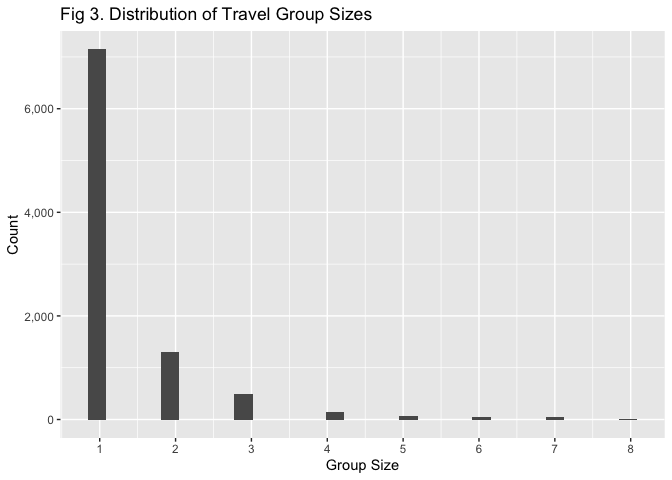

To round this out, we’ll have a quick look at how alternate dimension
transportation varies across group sizes.

``` r
# Add the new group size variable onto the main dataset then filter only for the training set
all_grouped <- all_grp_sep %>% left_join(all_grps, by = 'GroupId')

train_grouped <- all_grouped %>% filter(dataset == 'train') %>% select(-dataset)

table(train_grouped$group_size, train_grouped$Transported) %>% prop.table(1)
```

    ##    
    ##         FALSE      TRUE
    ##   1 0.5475546 0.4524454
    ##   2 0.4619501 0.5380499
    ##   3 0.4068627 0.5931373
    ##   4 0.3592233 0.6407767
    ##   5 0.4075472 0.5924528
    ##   6 0.3850575 0.6149425
    ##   7 0.4588745 0.5411255
    ##   8 0.6057692 0.3942308

It looks like transportation rate varies a little bit with group size.

That’s it for the categorical variables, we’ll move on to the numerical
variables now. *Note to self*: We may be able to infer with questionable
success the gender of each individual which may be a useful feature.

## 2.2 Numerical variables

The following are the numeric variables available to us as well as their
quartiles and number of NAs present.

``` r
# All stock features
all %>% 
  select(-dataset) %>% 
  select_if(is.numeric) %>% 
  summary()
```

    ##       Age         RoomService        FoodCourt      ShoppingMall    
    ##  Min.   : 0.00   Min.   :    0.0   Min.   :    0   Min.   :    0.0  
    ##  1st Qu.:19.00   1st Qu.:    0.0   1st Qu.:    0   1st Qu.:    0.0  
    ##  Median :27.00   Median :    0.0   Median :    0   Median :    0.0  
    ##  Mean   :28.77   Mean   :  222.9   Mean   :  452   Mean   :  174.9  
    ##  3rd Qu.:38.00   3rd Qu.:   49.0   3rd Qu.:   77   3rd Qu.:   29.0  
    ##  Max.   :79.00   Max.   :14327.0   Max.   :29813   Max.   :23492.0  
    ##  NA's   :270     NA's   :263       NA's   :289     NA's   :306      
    ##       Spa              VRDeck       
    ##  Min.   :    0.0   Min.   :    0.0  
    ##  1st Qu.:    0.0   1st Qu.:    0.0  
    ##  Median :    0.0   Median :    0.0  
    ##  Mean   :  308.5   Mean   :  306.8  
    ##  3rd Qu.:   57.0   3rd Qu.:   42.0  
    ##  Max.   :22408.0   Max.   :24133.0  
    ##  NA's   :284       NA's   :268

``` r
# + the room number of the passenger
all_cabin_spl %>% 
  select(Num) %>% 
  mutate(Num = as.numeric(Num)) %>% 
  summary()
```

    ##       Num        
    ##  Min.   :   0.0  
    ##  1st Qu.: 170.0  
    ##  Median : 431.0  
    ##  Mean   : 603.6  
    ##  3rd Qu.:1008.0  
    ##  Max.   :1894.0  
    ##  NA's   :299

Let’s view the distributions of these variables for those that were
transported and those that weren’t to see if we can spot any
relationships.

``` r
train_cabin_spl %>% 
  mutate(Num = as.numeric(Num)) %>% 
  # Select variables that are numeric or those named 'Transported' (the target)
  select_if(sapply(., is.numeric) | str_detect(names(.), "Transported")) %>% 
  gather(variable, value, -Transported) %>% 
  # Charting
  ggplot(aes(x = value, fill = Transported)) +
  geom_histogram(position = 'dodge', bins = 30) +
  # Split charts by variable
  facet_wrap(vars(variable), scales = 'free') +
  # Labels and legends
  scale_y_continuous(labels = comma) +
  scale_x_continuous(labels = comma) +
  theme(legend.position = "bottom") + 
  labs(x = 'Value', y = 'Count', title = 'Fig 4. Dsn of Numeric Variables vs Target ')
```

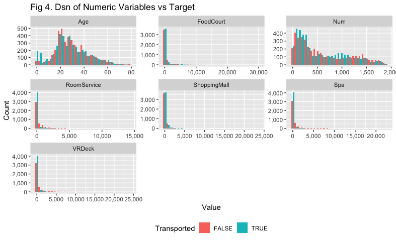

Nothing particularly illuminating here, although it seems like younger
children are more likely to be transported than others.

# 3 Feature Importance

While we’ve developed hypotheses regarding which features may have value
in predicting whether an individual has been transported, let’s back
these with some formal analysis. We’ll use mutual information to rank
the features in terms of relationship with the target variable, then
weight of evidence/information value to rank features and determine
which features we’ll use in our random forest.

``` r
# Prep the dataset - all_wrk will have both our PassengerId and GroupId variables split out, as well as our group size variable
all_wrk <- all_cabin_spl %>% 
  separate(PassengerId, c('GroupId', 'PassengerId'), "_") %>% 
  left_join(all_grps, by = 'GroupId') %>% 
  mutate_all(.funs = ~ na_if(., ""))

# We'll pull the training subset of this data-set since we want to compare values to the target
train_wrk <- all_wrk %>% filter(dataset == 'train') %>% select(-dataset)
```

## 3.1 Mutual information

[Mutual
information](https://www.kaggle.com/code/ryanholbrook/mutual-information)
is the first feature utility metric we’ll use to rank our features and
is advantageous since it measures relationships whether they are linear
or non-linear. Mutual information essentially measures the extent to
which knowledge of one variable reduces uncertainty about another.

We’ll be using the `infotheo` package to perform this part of the
analysis.

``` r
# Set up a data-frame that tracks variables and their mutual information value which we'll fill in...
mutual_info <- tibble(
  variable = train_wrk %>% select(-Transported, -GroupId, -Name, -PassengerId, -Num) %>% colnames(),
  mutual_info = NA_real_
)

# ... with this for-loop
for (i in 1:nrow(mutual_info)) {

  mutual_info[[i, 2]] <- mutinformation(train_wrk[mutual_info[[i, 1]]], train_wrk$Transported)
  
}

# Now that we have our mutual information values, let's create an ordered factor to ensure our plot has them in descending order
mutual_info_fct_order <- mutual_info %>% arrange(mutual_info) %>% pull(variable)

mutual_info <- mutual_info %>% mutate(variable = factor(variable, levels = mutual_info_fct_order))

# Finally, chart the mutual information values
mutual_info %>% 
  ggplot(aes(x = mutual_info, y = variable)) +
  geom_col() +
  labs(x = 'Mutual Information', y = 'Variable', title = 'Fig 5. Mutual Information of Features')
```

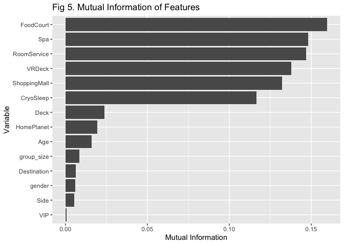

Some of our potential candidates for features actually have low mutual
information! Those would be HomePlanet, Destination, Deck, and Age. It
seems that the focus is more on the variables that track passenger
spending on the luxury amenities, as well as whether the patient has
elected to be in CryoSleep or not (this makes sense, as whether a person
spends on amenities or not depends on whether a person has elected to go
into cryosleep as we’ll see in the next section).

Now that we have a ranking, let’s see if we can validate these and also
determine a cut-off for usefulness using weight of evidence analysis.

## 3.2 Weight of evidence

[Weight of
evidence](https://www.listendata.com/2015/03/weight-of-evidence-woe-and-information.html)
(W) allows us to rank feature importance, and also provides a benchmark
above which we can say the feature is likely to be useful to any
prediction efforts we’ll be making. WOE is calculated across a feature
column and the scores then aggregated into a value called an Information
Value (IV). In general, an IV that is greater than 0.1 indicates at
least medium predictive power, we’ll be using this as our baseline IV
cutoff for feature importance. We’ll be using the `Information` package
to perform this part of this analysis.

``` r
# To do this, we'll need all character variables as factors and logical variables as numerics
train_woe <- train_wrk %>% 
  select(-GroupId, -Name, -PassengerId) %>% 
  # Convert all character columns to factors
  mutate_if(
    is.character,
    factor
  ) %>% 
  # Force Transported to numeric
  mutate(Transported = as.numeric(Transported))

# Calculate Weight of Evidence over each column, then Information Value
inf_value <- create_infotables(data = train_woe, y = "Transported", bins = 10)$Summary
```

    ## [1] "Variable Num was removed because it is a non-numeric variable with >1000 categories"

With the Information Values calculated, let’s then compare the order of
variables with those produced by the mutual information analysis:

``` r
# Using gridExtra to arrange two separate ggplot2 charts
grid.arrange(
  mutual_info %>% 
    ggplot(aes(x = mutual_info, y = variable)) +
    geom_col() +
    labs(x = 'Mutual Information', y = 'Variable', title = 'Fig 6. Mutual Information vs.'),
  inf_value %>% 
    mutate(Variable = factor(Variable, levels = inf_value %>% arrange(IV) %>% pull(Variable))) %>% 
    ggplot(aes(x = IV, y = Variable)) +
    geom_col() +
    labs(x = 'Information Value', y = element_blank(), title = 'Information Value') +
    geom_vline(xintercept = 0.1),
  ncol = 2
)
```

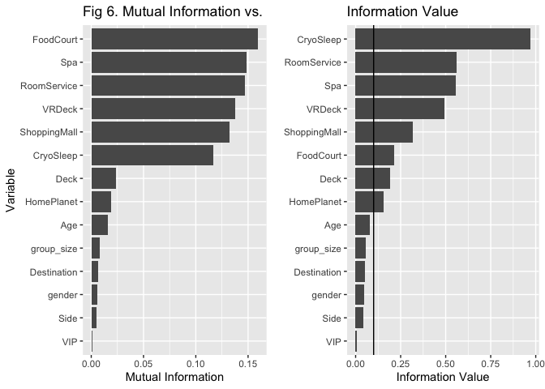

Generally the two measures agree in terms of ranking feature strength.
Keeping to our 0.1 Information Value cutoff, the variables we’ll be
using in our model are: CryoSleep, RoomService, Spa, VRDeck,
ShoppingMall, FoodCourt, Deck, HomePlanet.

# 4 Missing/NAs

Now that we know what our data looks like and what features we might
like to focus on, we can turn our attention to filling in the holes in
our data-set.

``` r
# Let's create a working copy of the data-set we have at this point that we can modify at will
all_wrk_tmp <- all_wrk

# Count number of rows with at least one NA in it
all_wrk_tmp[rowSums(is.na(all_wrk_tmp %>% mutate_all(.funs = ~ na_if(., "")))) > 0, ] %>% nrow()
```

    ## [1] 6364

It looks like 49.1% of the rows in our data-set have at least one NA in
them. A substantial amount - we’ll want to plug as many of these holes
as we can.

Where do these missing values reside?

``` r
(
  all_wrk_tmp %>% 
    mutate_all(.funs = ~ na_if(., "")) %>% 
    sapply(function(x) sum(is.na(x))) / nrow(all_wrk_tmp)
) %>% 
  as.list() %>% 
  data.frame() %>% 
  gather(variable, missing_pct) %>% 
  arrange(desc(missing_pct))
```

    ##        variable missing_pct
    ## 1   Transported  0.32976099
    ## 2     CryoSleep  0.02390131
    ## 3  ShoppingMall  0.02359291
    ## 4          Deck  0.02305320
    ## 5           Num  0.02305320
    ## 6          Side  0.02305320
    ## 7           VIP  0.02282190
    ## 8          Name  0.02266769
    ## 9     FoodCourt  0.02228219
    ## 10   HomePlanet  0.02220509
    ## 11          Spa  0.02189668
    ## 12  Destination  0.02112567
    ## 13          Age  0.02081727
    ## 14       VRDeck  0.02066307
    ## 15  RoomService  0.02027756
    ## 16      GroupId  0.00000000
    ## 17  PassengerId  0.00000000
    ## 18      dataset  0.00000000
    ## 19   group_size  0.00000000

We’ll be using two strategies to fill these NAs in here. The first being
imputation where we infer what the missing values should be based on
relationships we find in the dataset, the second being prediction where
we use the `mice` package to predict missing values using random
forests.

For now, we’ll focus on filling in values for features that we know will
go into our model and features that are related to those.

## 4.1 `CryoSleep`

Our first clue is that individuals who are put into cryosleep are
confined to their cabin for the trip (I should hope so). This is likely
to mean that they would have no need to pay for luxury amenities (i.e.,
`RoomService`, `FoodCourt`, `ShoppingMall`, `Spa`, and `VRDeck` should
be 0 for those with `CryoSleep == TRUE`). Let us confirm that this is
true throughout the dataset:

``` r
all_cryo_sub <- all_wrk_tmp %>% 
  # Create a variable that sums all luxury spend columns
  mutate(lux_spend = ShoppingMall + VRDeck + FoodCourt + Spa + RoomService)

all_cryo_sub %>% filter(CryoSleep & lux_spend > 0) %>% nrow() == 0
```

    ## [1] TRUE

We can now be fairly certain that we can use this relationship to infer
that the value of `CryoSleep` is `FALSE` when the sum of all luxury
spending is greater than 0.

Note that we don’t have the information to infer the converse - i.e. we
cannot assume that `CryoSleep` is `TRUE` when luxury spending is 0.
Someone that committed no money to the spaceship’s luxury amenities may
have just not been attracted to the Titanic’s offerings. It would be
interesting to test this though, let’s calculate the observed
conditional probability that a person chose to be in cryosleep, given
that they spent no money on luxury amenities.

``` r
(
  nonspender_cryosleep_rate <- all_wrk_tmp %>% 
    mutate(lux_spend_keepnas = ShoppingMall + VRDeck + FoodCourt + Spa + RoomService) %>% 
    filter(!is.na(CryoSleep) & lux_spend_keepnas == 0) %>% 
    group_by(CryoSleep) %>% 
    tally() %>% 
    mutate(pct = n / sum(n)) %>% 
    filter(CryoSleep) %>% 
    pull(pct)
)
```

    ## [1] 0.8591341

It’s pretty high! Let’s keep this rate in our back pocket to validate
our results once our imputations and predictions are complete for the
`CryoSleep` feature.

For now, let’s put what we’ve learnt into effect and assign `FALSE`s to
`CryoSleep` where luxury spend is \> 0:

``` r
all_wrk_tmp <- all_wrk_tmp %>% 
  mutate(
    # Create a sum of all luxury spends, allowing NAs to flow through so we don't accidentally catch any in the following statement
    lux_spend_ignorenas = rowSums(select(., ShoppingMall, VRDeck, FoodCourt, Spa, RoomService), na.rm = TRUE),
    # Impute the value of CryoSleep where the sum of luxury spend (where all values of luxury spend were available) is non-zero
    CryoSleep = case_when(
      is.na(CryoSleep) & lux_spend_ignorenas > 0 ~ FALSE,
      TRUE ~ CryoSleep
    )
  )
```

For `CryoSleep` where luxury spend isn’t greater than zero, we’ll use
the `mice` package to predict missing values with random forests.

``` r
# Create imputation
imput_cryosleep <- all_wrk_tmp %>%
  mutate(
    HomePlanet_fct = factor(HomePlanet), 
    Destination_fct = factor(Destination), 
    Deck_fct = factor(Deck)
  ) %>%
  select(CryoSleep, HomePlanet_fct, Destination_fct, Deck_fct, ShoppingMall, VRDeck, FoodCourt, Spa, RoomService) %>%
  mice(method = 'rf', seed = 24601, maxit = 1) %>% # Who am I?
  complete() %>% 
  mutate(CryoSleep = as.logical(CryoSleep)) %>% 
  select(-ends_with('_fct'))
```

    ## 
    ##  iter imp variable
    ##   1   1  CryoSleep  HomePlanet_fct  Destination_fct  Deck_fct  ShoppingMall  VRDeck  FoodCourt  Spa  RoomService
    ##   1   2  CryoSleep  HomePlanet_fct  Destination_fct  Deck_fct  ShoppingMall  VRDeck  FoodCourt  Spa  RoomService
    ##   1   3  CryoSleep  HomePlanet_fct  Destination_fct  Deck_fct  ShoppingMall  VRDeck  FoodCourt  Spa  RoomService
    ##   1   4  CryoSleep  HomePlanet_fct  Destination_fct  Deck_fct  ShoppingMall  VRDeck  FoodCourt  Spa  RoomService
    ##   1   5  CryoSleep  HomePlanet_fct  Destination_fct  Deck_fct  ShoppingMall  VRDeck  FoodCourt  Spa  RoomService

``` r
# Let's quickly check the percentage of passengers who spend 0 on luxury amenities and who were also in cryosleep to compare against what we calculated earlier
imput_cryosleep %>% 
  mutate(lux_spend_keepnas = ShoppingMall + VRDeck + FoodCourt + Spa + RoomService) %>% 
  filter(!is.na(CryoSleep) & lux_spend_keepnas == 0) %>% 
  group_by(CryoSleep) %>% 
  tally() %>% 
  mutate(pct = n / sum(n)) %>% 
  filter(CryoSleep) %>% 
  pull(pct)
```

    ## [1] 0.8626333

Pretty close to our previously calculated rate of 85.9%.

To wrap up for the cryosleep imputation, we’ll add the filled in values
back to the main dataset and compare the distribution of imputed values
against those that were there originally.

``` r
all_wrk_tmp <- all_wrk_tmp %>% 
  select(-CryoSleep) %>% 
  bind_cols(imput_cryosleep %>% select(CryoSleep))

# See if imputed values on aggregate change the distribution
all_wrk %>%
  filter(!is.na(CryoSleep)) %>% 
  group_by(CryoSleep) %>% 
  # Get number of rows for CryoSleep == TRUE and CryoSleep == FALSE
  tally() %>% 
  mutate(dataset = 'Unmodified') %>% 
  bind_rows(
    all_wrk_tmp %>% 
      filter(!is.na(CryoSleep)) %>% 
      group_by(CryoSleep) %>% 
      tally() %>% 
      mutate(dataset = 'Imputed')
  ) %>% 
  group_by(dataset) %>% 
  mutate(pct = n / sum(n)) %>% 
  ungroup() %>% 
  # Charting
  ggplot(aes(x = dataset, fill = CryoSleep, y = pct, label = percent(pct, 0.1))) +
  geom_col(position = 'dodge') +
  # Labels and theme
  scale_y_continuous(labels = percent) +
  labs(x = 'Dataset', y = 'Percent', title = 'Fig 7. Imputed vs. original dataset') +
  geom_text(
    position = position_dodge(width = .9),
    vjust = -0.5,
    size = 3
  ) +
  theme(legend.position = 'bottom')
```


## 4.2 Luxury amenities

### 4.2.1 Cryosleeping individuals

Given what we’ve learnt in the previous section, we can infer that the
luxury spend for people in cryosleep will be zero.

``` r
all_wrk_tmp <- all_wrk_tmp %>% 
  # Where CryoSleep == TRUE and a luxury spend variable is NA, make it 0.
  mutate_at(
    .vars = vars(ShoppingMall, VRDeck, FoodCourt, Spa, RoomService),
    .funs = ~ ifelse(CryoSleep & is.na(.), 0, .)
  )
```

### 4.2.2 Non-cryosleeping individuals

Looking through the distributions of other variables vs. luxury spend,
there aren’t many convincing relationships we can draw on to impute
missing values for individuals who aren’t cryosleeping. However, there
are some patterns visible in the data:

``` r
grid.arrange(
  all_wrk_tmp %>%
    filter(!CryoSleep) %>%
    mutate(lux_spend = ShoppingMall + VRDeck + FoodCourt + Spa + RoomService) %>%
    ggplot(aes(y = lux_spend, x = Destination, fill = HomePlanet)) +
    geom_boxplot() +
    scale_y_continuous(labels = dollar) +
    labs(x = 'Destination', y = 'Total Luxury Spend', title = 'Fig 8. Luxury spend vs. \nDestination, Home planet & '),
  all_wrk_tmp %>%
    filter(!CryoSleep) %>%
    mutate(lux_spend = ShoppingMall + VRDeck + FoodCourt + Spa + RoomService) %>%
    mutate(Num = as.numeric(Num)) %>%
    ggplot(aes(x = Num, y = lux_spend, colour = HomePlanet)) +
    geom_point() +
    scale_y_continuous(labels = dollar) +
    scale_x_continuous(labels = comma) +
    labs(x = 'Number', y = element_blank(), title = 'Luxury spend vs. \nRoom number, Home planet'),
  ncol = 2
)
```

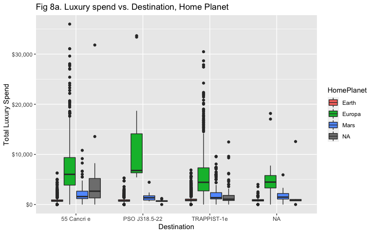

For now, we’ll predict the remaining luxury spend values on some
variables such as HomePlanet, Destination, and Deck - variables that
seem to have some association with luxury spend.

``` r
# Pull out examples where CryoSleep is not TRUE
all_wrk_noncryo <- all_wrk_tmp %>% filter(!CryoSleep | is.na(CryoSleep))
  
imput_lux_spend <- all_wrk_noncryo %>% 
  mutate(
    HomePlanet_fct = factor(HomePlanet), 
    Destination_fct = factor(Destination), 
    Deck_fct = factor(Deck)
  ) %>% 
  select(HomePlanet_fct, Destination_fct, Deck_fct, ShoppingMall, VRDeck, FoodCourt, Spa, RoomService) %>% 
  mice(method = 'rf', seed = 24601, maxit = 1) %>% 
  complete() %>% 
  select(-ends_with('_fct'))
```

    ## 
    ##  iter imp variable
    ##   1   1  HomePlanet_fct  Destination_fct  Deck_fct  ShoppingMall  VRDeck  FoodCourt  Spa  RoomService
    ##   1   2  HomePlanet_fct  Destination_fct  Deck_fct  ShoppingMall  VRDeck  FoodCourt  Spa  RoomService
    ##   1   3  HomePlanet_fct  Destination_fct  Deck_fct  ShoppingMall  VRDeck  FoodCourt  Spa  RoomService
    ##   1   4  HomePlanet_fct  Destination_fct  Deck_fct  ShoppingMall  VRDeck  FoodCourt  Spa  RoomService
    ##   1   5  HomePlanet_fct  Destination_fct  Deck_fct  ShoppingMall  VRDeck  FoodCourt  Spa  RoomService

Finally, we’ll add the predicted values back to the dataset, and compare
the distributions of predicted/imputed values vs. the original dataset.

``` r
all_wrk_tmp <- all_wrk_tmp %>% 
  # Filter out !CryoSleep and is.na(CryoSleep) as they're contained in all_wrk_noncryo
  filter(CryoSleep) %>% 
  bind_rows(
    all_wrk_noncryo %>%
      select(-ShoppingMall, -VRDeck, -FoodCourt, -Spa, -RoomService) %>% 
      bind_cols(
        imput_lux_spend %>% 
          select(ShoppingMall, VRDeck, FoodCourt, Spa, RoomService)
      )
  ) %>% 
  mutate(lux_spend = ShoppingMall + VRDeck + FoodCourt + Spa + RoomService)

all_wrk %>% 
  select(ShoppingMall, VRDeck, FoodCourt, Spa, RoomService) %>% 
  mutate(dataset = 'Unmodified') %>% 
  bind_rows(
    all_wrk_tmp %>% 
      select(ShoppingMall, VRDeck, FoodCourt, Spa, RoomService) %>% 
      mutate(dataset = 'Imputed')
  ) %>% 
  gather(variable, value, -dataset) %>% 
  ggplot(aes(x = value, fill = dataset)) +
  geom_histogram(position = 'dodge') +
  facet_grid(rows = vars(variable), scales = 'free') +
  theme(legend.position = 'bottom') +
  scale_x_continuous(limits = c(NA, 10000), labels = comma) +
  scale_y_continuous(labels = comma) +
  labs(x = 'Value', y = 'Count', fill = 'Dataset', title = 'Fig 9. Imputed vs. original dataset')
```

    ## `stat_bin()` using `bins = 30`. Pick better value with `binwidth`.

    ## Warning: Removed 1730 rows containing non-finite values (stat_bin).

    ## Warning: Removed 5 rows containing missing values (geom_bar).

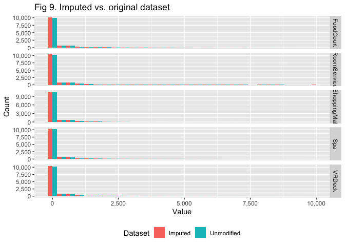

## 4.3 `HomePlanet`

Looking at the deck of a passenger vs. their home planet, it looks like
we can reasonably infer that if you are on decks A, B, C, or T, your
HomePlanet was Europa. Further, it looks like deck G is only inhabited
by people from Earth.

``` r
all_wrk_tmp %>% 
  group_by(HomePlanet, Deck) %>% 
  tally() %>% 
  ggplot(aes(x = Deck, y = n, fill = HomePlanet)) +
  geom_col(position = 'dodge') +
  scale_y_continuous(labels = comma) +
  labs(y = 'Count', title = 'Fig 10. HomePlanet vs. Deck')
```

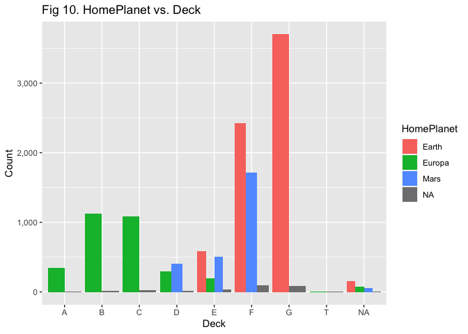

``` r
# Apply this rule to the dataset
all_wrk_tmp <- all_wrk_tmp %>% 
  mutate(
    HomePlanet = case_when(
      is.na(HomePlanet) & Deck %in% c('A', 'B', 'C', 'T') ~ 'Europa',
      is.na(HomePlanet) & Deck == 'G' ~ 'Earth',
      TRUE ~ HomePlanet
    )
  )
```

We can also hypothesise that people within the same travel group are
most likely to have the same home planet. Confirming this:

``` r
all_wrk_tmp %>% 
  distinct(GroupId, HomePlanet) %>% 
  filter(!is.na(HomePlanet)) %>% 
  group_by(GroupId) %>% 
  summarise(n = n(), .groups = 'drop') %>% 
  filter(n > 1) %>% nrow() == 0
```

    ## [1] TRUE

``` r
# Apply this rule to the dataset
all_wrk_grp_homes <- all_wrk_tmp %>% 
  filter(!is.na(HomePlanet)) %>% 
  distinct(GroupId, HomePlanet) %>% 
  rename(HomePlanet_supplement = HomePlanet)

all_wrk_tmp <- all_wrk_tmp %>% 
  left_join(all_wrk_grp_homes, by = c("GroupId")) %>% 
  mutate(HomePlanet = coalesce(HomePlanet, HomePlanet_supplement), .keep = 'unused')
```

Finally, we know that there is some association between `HomePlanet` and
room number based on information from the last section, so we’ll use
this as one of the values used to predict the remaining NA values:

``` r
imput_homeplanet <- all_wrk_tmp %>% 
  mutate(
    HomePlanet_fct = factor(HomePlanet),
    Deck_fct = factor(Deck),
    Num_num = as.numeric(Num)
  ) %>% 
  select(HomePlanet_fct, Deck_fct, Num_num) %>% 
  mice(method = 'rf', seed = 24601, maxit = 1) %>% 
  complete() %>% 
  mutate(HomePlanet = as.character(HomePlanet_fct)) %>% 
  select(-ends_with('_fct'), -ends_with('_num'))
```

    ## 
    ##  iter imp variable
    ##   1   1  HomePlanet_fct  Deck_fct  Num_num
    ##   1   2  HomePlanet_fct  Deck_fct  Num_num
    ##   1   3  HomePlanet_fct  Deck_fct  Num_num
    ##   1   4  HomePlanet_fct  Deck_fct  Num_num
    ##   1   5  HomePlanet_fct  Deck_fct  Num_num

``` r
# Add these back to the dataset
all_wrk_tmp <- all_wrk_tmp %>% 
  select(-HomePlanet) %>% 
  bind_cols(imput_homeplanet)
  
# Check distribution of imputed values
all_wrk %>% 
  group_by(HomePlanet) %>% 
  tally() %>% 
  mutate(pct = n / sum(n)) %>% 
  mutate(dataset = 'Unmodified') %>% 
  bind_rows(
    all_wrk_tmp %>% 
      group_by(HomePlanet) %>% 
      tally() %>% 
      mutate(pct = n / sum(n)) %>% 
      mutate(dataset = 'Imputed')
  ) %>% 
  # Charting
  ggplot(aes(x = HomePlanet, y = pct, fill = dataset, label = percent(pct, 0.1))) +
  geom_col(position = 'dodge') +
  # Labels
  scale_y_continuous(labels = percent) +
  theme(legend.position = 'bottom') +  
  labs(x = 'Home Planet', y = 'Percent', fill = 'Dataset', title = 'Fig 11. Imputed vs. original dataset') +
  geom_text(
    position = position_dodge(width = .9),
    vjust = -0.5,
    size = 3
  )
```

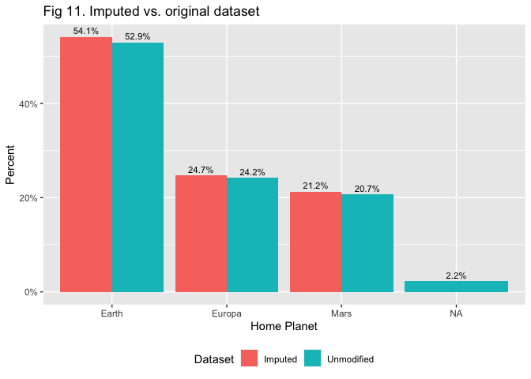

## 4.4 `Deck`

There isn’t much to go on for imputing missing `Deck` values, except for
the fact that people within the same travel group tend to stay on decks
are in close vicinity to each other.

``` r
# Get number of people in each group and where they're located
all_wrk_grps <- all_wrk_tmp %>% 
  filter(group_size > 1) %>% 
  select(GroupId, PassengerId, Deck, Num, Side) %>% 
  group_by(GroupId) %>% 
  mutate(count = n()) %>% 
  ungroup() %>% 
  arrange(GroupId, PassengerId)

# Convert the Deck variable to a numeric mapping so that deck distance may be calculated easily
deck_refactor <- tibble(
  Deck = all_wrk_grps %>% filter(!is.na(Deck)) %>% distinct(Deck) %>% pull(Deck) %>% sort(),
  DeckNum = c(1:(all_wrk_grps %>% filter(!is.na(Deck)) %>% distinct(Deck) %>% pull(Deck) %>% length()))
)

all_wrk_grps %>% 
  left_join(deck_refactor, by = 'Deck') %>% 
  group_by(GroupId) %>% 
  summarise(
    range = max(DeckNum) - min(DeckNum),
    .groups = 'drop'
  ) %>% 
  ggplot(aes(x = range)) +
  geom_histogram() +
  scale_y_continuous(labels = comma) +
  labs(x = 'Deck Distance with Groups', y = 'Count', title = 'Fig 12. Dsn of deck distance within groups')
```

    ## `stat_bin()` using `bins = 30`. Pick better value with `binwidth`.

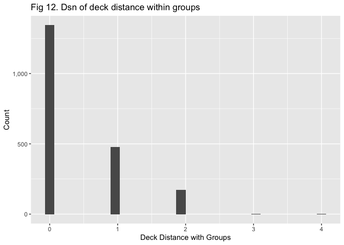

This might enable some sort of modelling of missing deck information
based on the deck of others within the group in future, however we’ll go
with a simpler method here. Predicting deck with `mice` doesn’t tend to
preserve the distribution we see in the previous chart, so we’ll simply
assign missing deck values to a ‘missing’ bucket for now.

``` r
all_wrk_tmp <- all_wrk_tmp %>% 
  mutate(Deck = ifelse(is.na(Deck), 'NA', Deck))
```

## 4.5 Final roll-up

We’ll do some final checks over the dataset here before we move on to
the train/validation/test split and fitting the model.

First, check if there were any missing values we missed in our variables
of interest:

``` r
all_wrk_tmp %>% 
  select_at(vars(inf_value %>% filter(IV > 0.1) %>% .$Variable)) %>% 
  sapply(function(x) sum(is.na(x)))
```

    ##    CryoSleep  RoomService          Spa       VRDeck ShoppingMall    FoodCourt 
    ##            0            0            0            0            0            0 
    ##         Deck   HomePlanet 
    ##            0            0

Let’s impute the value of age in case we need to use it later:

``` r
imput_age <- all_wrk_tmp %>% 
  select(-GroupId, -PassengerId, -Name, -Transported, -dataset, -Num) %>% 
  # Convert all character columns to factors
  mutate_if(
    is.character,
    factor
  ) %>%
  mice(method = 'rf', seed = 24601, maxit = 1) %>% 
  complete()
```

    ## 
    ##  iter imp variable
    ##   1   1  Side  Destination  Age  VIP
    ##   1   2  Side  Destination  Age  VIP
    ##   1   3  Side  Destination  Age  VIP
    ##   1   4  Side  Destination  Age  VIP
    ##   1   5  Side  Destination  Age  VIP

    ## Warning: Number of logged events: 20

``` r
all_wrk_tmp <- all_wrk_tmp %>% 
  select(-Age) %>% 
  bind_cols(imput_age %>% select(Age))
```

Next, we’ll check that we haven’t lost any people during this process:

``` r
identical(
  all_wrk %>% distinct(GroupId, PassengerId) %>% arrange_all(),
  all_wrk_tmp %>% distinct(GroupId, PassengerId) %>% arrange_all()
)
```

    ## [1] TRUE

Finally, we’ll convert all character and logical/boolean features into
factors for our random forest model.

``` r
all_wrk_final <- all_wrk_tmp %>% 
  mutate_at(
    .vars = vars(Transported, CryoSleep, Deck, HomePlanet),
    .funs = factor
  )
```

# 5 Training

## 5.1 Splitting into train/validation/test sets

We’ll split the dataset back into it’s original train and test
groupings, then split the training set down further into a training set
and a validation set with a 70%/30% split.

``` r
test_clean <- all_wrk_final %>% filter(dataset == 'test') %>% select(-dataset)
train_clean <- all_wrk_final %>% filter(dataset == 'train') %>% select(-dataset)
```

We’ll be a little careful when splitting the training set into a
train/validation set. We do not want people from the same group to be
spread across the two sets - this likely has the potential to cause
target leakage.

First lets check that there are no groups that are split up between the
provided train and test sets:

``` r
all_wrk_final %>% 
  distinct(GroupId, dataset) %>% 
  group_by(GroupId) %>% 
  tally() %>% 
  ungroup() %>% 
  filter(n > 1) %>% 
  nrow() == 0
```

    ## [1] TRUE

Next, how we’ll do this is we’ll split on distinct `GroupId` as opposed
to randomly sampling 70%/30% of `train_clean`’s rows. This will not net
us an exact 70%/30% split, but it will be good enough for our purposes.

``` r
set.seed(24601)
training_proportion <- 0.7

train_val_split <- train_clean %>% 
  group_by(GroupId) %>% 
  # Get count of rows under each GroupId
  tally() %>% 
  # Generate a random number for each row which will be compared against the 
  #  probability of being in the test set (70%).
  mutate(rand = runif(nrow(.))) %>% 
  mutate(grouping = ifelse(rand < training_proportion, 'train', 'validation'), .keep = 'unused')

# Confirm this preserves the ~70/30 split for the most part:
train_val_split %>% 
  group_by(grouping) %>% 
  summarise(n = sum(n), .groups = 'drop') %>% 
  mutate(pct = percent(n / sum(n), 0.1))
```

    ## # A tibble: 2 x 3
    ##   grouping       n pct  
    ##   <chr>      <int> <chr>
    ## 1 train       6100 70.2%
    ## 2 validation  2593 29.8%

``` r
# Split train_clean based on the decided GroupId arrangement
train_new <- train_clean %>% filter(GroupId %in% (train_val_split %>% filter(grouping == 'train') %>% .$GroupId))
valid_new <- train_clean %>% filter(GroupId %in% (train_val_split %>% filter(grouping == 'validation') %>% .$GroupId))
```

## 5.2 Random Forest

### 5.2.1 Fitting process

We’ll input our training set into the random forest model now, then plot
the out-of-bag (OOB) error across each iteration. A random forest is an
ensemble model consisting of a number of decision trees trained on a
random subset (Drawn with replacement) of the available training data.
Out-of-bag error simply measures the error of the model on the subset of
training data that wasn’t used in a given decision tree.

``` r
set.seed(24601)

# As a reminder, here's a list of our features of interest
( features_of_interest <- c(inf_value %>% filter(IV > 0.1) %>% .$Variable, 'Age') %>% paste(collapse = " + ") )
```

    ## [1] "CryoSleep + RoomService + Spa + VRDeck + ShoppingMall + FoodCourt + Deck + HomePlanet + Age"

``` r
st_rf_mod <- randomForest(
  as.formula(
    paste('Transported', "~", features_of_interest)
  ),
  data = train_new
)

# Plot OOB error
plot(st_rf_mod, main = 'Fig 13. Random Forest OOB Error')
legend(
  'topright',
  colnames(st_rf_mod$err.rate),
  col = 1:3,
  fill = 1:3
)
```

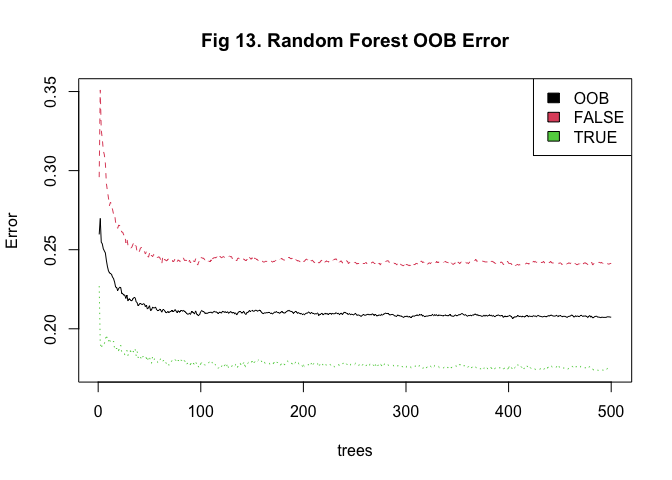

We can see that at the end of the fitting process, the model has an OOB
error of 0.2096721. The red and green lines show the error in predicting
whether a person was not transported and whether a person was
transported respectively; with the error in predicting whether a person
was transported generally being lower (0.1776124 vs 0.2426055).

We’ll take a quick look at variable importance before moving on to
checking performance over our validation set.

``` r
# Plot variable importance
importance_output <- importance(st_rf_mod)
importance <- tibble(
  var = row.names(importance_output), 
  imp = round(importance_output[ ,'MeanDecreaseGini'],2)
)

importance %>% 
  mutate(var = factor(var, levels = importance %>% arrange(imp) %>% .$var)) %>% 
  ggplot(aes(x = imp, y = var)) +
  geom_col() +
  labs(x = 'Importance', y = 'Variable', title = 'Fig 14. Random Forest - Variable Importance')
```

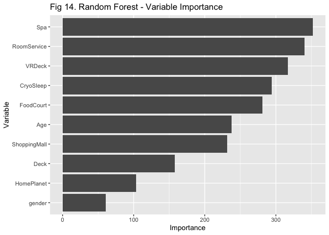<!-- -->

Feature importance generally agrees with the feature utility metrics
used previously that Deck and HomePlanet are less important in
predicting whether someone was inadvertently teleported or not. The top
6 features in terms of importance are the same top six that appear using
mutual information and information value, albeit reshuffled a little
bit.

### 5.2.2 Validation

We’ll now use this model to predict over our validation set, then we’ll
check performance metrics such as sensitivity and specificity. Note that
the sensitivity is our True Positive Rate, and specificity is our True
Negative Rate.

``` r
# Predict values and bind to the validation data-frame
predicted_values <- valid_new %>% 
  bind_cols(
    Prediction = predict(st_rf_mod, valid_new)
  )

# Confusion matrix and accuracy metrics
prediction_cm <- confusionMatrix(
  predicted_values$Prediction, predicted_values$Transported
)

prediction_cm$table
```

    ##           Reference
    ## Prediction FALSE TRUE
    ##      FALSE   988  197
    ##      TRUE    318 1090

``` r
prediction_cm$overall[['Accuracy']]
```

    ## [1] 0.8013884

``` r
prediction_cm$byClass[['Sensitivity']]
```

    ## [1] 0.7565084

``` r
prediction_cm$byClass[['Specificity']]
```

    ## [1] 0.8469308

Our sensitivity and specificity are not too bad, although I’m sure we
can get better with a more targeted model!

Before using this model to predict over the test set, let’s take a look
at the VIP sub-group. Since they make up a small portion of total
passengers, we aren’t expecting the model to have predicted their
transportation rate with as much accuracy as the rest of the passengers.

``` r
# Confusion matrix for VIP members
prediction_vip_cm <- confusionMatrix(
  (predicted_values %>% filter(VIP))$Prediction, (predicted_values %>% filter(VIP))$Transported
)

prediction_vip_cm$table
```

    ##           Reference
    ## Prediction FALSE TRUE
    ##      FALSE    35    3
    ##      TRUE      2   15

``` r
prediction_vip_cm$overall[['Accuracy']]
```

    ## [1] 0.9090909

``` r
prediction_vip_cm$byClass[['Sensitivity']]
```

    ## [1] 0.9459459

``` r
prediction_vip_cm$byClass[['Specificity']]
```

    ## [1] 0.8333333

It’s not too bad. Note the sensitivity is greater than that of the
aggregate dataset, but the specificity is lower. i.e. We’re more likely
to correctly predict that an individual has been transported to an
alternate dimension than in the aggregate dataset, but less likely to
correctly predict that an individual was not transported to an
alternative dimension.

By now we’ve established a good baseline; let’s see if we can improve on
this with other models.

## 5.3 XGBoost

Let’s try using an extreme gradient boosting
([XGBoost](https://towardsdatascience.com/a-beginners-guide-to-xgboost-87f5d4c30ed7))
model to predict transportation here. XGBoost in an ensemble technique
where a single weak classifier is progressively turned into a stronger
one by iteratively predicting the residuals from each new model
iteration. This approach is understood to control both bias and
variance, in contrast to the random forest algorithm which utilises
multiple separate models and bootstrapped aggregation (bagging) which
only controls for high variance in the model.

XGBoost only works over numeric variables, so we’ll need to one-hot
encode our factors, we’ll use `caret` to do this:

``` r
# Define a function pipeline to clean all three data-frames
xgb_prep <- function(data, iv_threshold = 0.1) {
  
  # Bin Age and filter only for variables we're interested in
  data_tmp <- data %>% 
    mutate(AgeGrp = cut(Age, breaks = 10 * c(-1:10))) %>% 
    select_at(vars(inf_value %>% filter(IV > iv_threshold) %>% .$Variable, AgeGrp, Transported))
  
  # Force logical to numeric
  data_tmp <- data_tmp %>% 
    mutate_at(
      .vars = vars(CryoSleep#, Transported
                   ),
      .funs = ~ as.numeric(.) - 1
    ) %>% 
    # Label needs to be a factor to show this is a classification problem
    mutate(Transported = as.factor(Transported)) 
  
  # One-hot encode Deck and HomePlanet
  dummy_var_model <- dummyVars(~ Deck + HomePlanet + AgeGrp, data = data_tmp)
  
  # Add back to main dataset
  data_tmp <- data_tmp %>% 
    select(-Deck, -HomePlanet, -AgeGrp) %>% 
    bind_cols(
      predict(dummy_var_model, newdata = data_tmp)
    )
  
  return(data_tmp)
  
}

train_xgb <- xgb_prep(train_new)
valid_xgb <- xgb_prep(valid_new)
test_xgb <- xgb_prep(test_clean)
```

### 5.3.1 Fitting process

XGBoost is engineered for fast implementation, so we can experiment with
hyperparameters a little easier. Let’s use a method for finding [optimal
hyperparameters](https://www.kaggle.com/code/prashant111/a-guide-on-xgboost-hyperparameters-tuning/notebook)
that tends towards the more exhaustive side of things: [the grid
search](https://www.projectpro.io/recipes/tune-hyper-parameters-grid-search-r).
We’ll pass vectors of possible values for each hyperparameter to the
`train` function from the `caret` package. This will in turn train an
XGBoost model across all possible permutations of these possible values,
and will then select the model with the lowest Root Mean Squared Error
(RMSE).

``` r
# First, define the controls we want to train with; we're choosing 10-fold cross-validation and a grid search
xgb_control <- trainControl(
  method = "cv", 
  number = 5, 
  search = "grid"
)

# Next, listing the possible hyper-parameters we'll train over
#  For hyper-parameters not listed here, we'll use the default value
xgb_hyp_params <- expand.grid(
  max_depth = c(3, 4, 5, 6), # Controls the max depth of each tree; higher values = more chance of over-fitting 
  nrounds = c(1:15) * 50, # Number of trees to go through
  eta = c(0.01, 0.1, 0.2), # Analogous to learning rate
  gamma = c(0, 0.01, 0.1), # The minimum loss reduction required to split the next node
  
  # Default values for remaining hyper-parameters
  subsample = c(0.5, 0.75, 1),
  min_child_weight = 1,
  colsample_bytree = 0.6
)

# Unregister any parallel workers
env <- foreach:::.foreachGlobals
rm(list=ls(name=env), pos=env)

set.seed(24601)

# Training the model
st_xgb_mod <- train(
  Transported ~ ., 
  data = train_xgb, 
  method = "xgbTree", 
  trControl = xgb_control, 
  tuneGrid = xgb_hyp_params
)
```

Taking a quick look at feature importance, everything seems to generally
align with what we’ve seen previously.

``` r
xgb.plot.importance(
  xgb.importance(
    colnames(train_xgb %>% select(-Transported)), 
    model = st_xgb_mod$finalModel
  )
)
title('Fig 15. XGBoost Feature Importance')
```

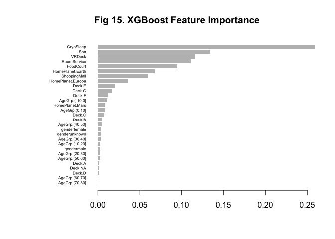

### 5.3.2 Validation

In validating this model, we see that it hasn’t done much better than
the random forest we set up earlier. Accuracy is up slightly as well as
specificity, however sensitivity is lower.

``` r
predicted_values_xgb <- valid_xgb %>% 
  bind_cols(
    Prediction = predict(st_xgb_mod, valid_xgb)
  )

# Confusion matrix and accuracy metrics
prediction_cm_xgb <- confusionMatrix(
  predicted_values_xgb$Prediction, predicted_values_xgb$Transported
)

prediction_cm_xgb$table
```

    ##           Reference
    ## Prediction FALSE TRUE
    ##      FALSE   968  168
    ##      TRUE    338 1119

``` r
prediction_cm_xgb$overall[['Accuracy']]
```

    ## [1] 0.8048592

``` r
prediction_cm_xgb$byClass[['Sensitivity']]
```

    ## [1] 0.7411945

``` r
prediction_cm_xgb$byClass[['Specificity']]
```

    ## [1] 0.8694639

# 6 Prediction

Finally, let’s use this model to predict over the test set that Kaggle
provided.

``` r
final_output <- test_clean %>% 
  unite('PassengerId', GroupId:PassengerId, sep = "_") %>% 
  select(PassengerId) %>% 
  bind_cols(
    Transported_fct = predict(st_rf_mod, test_clean)
  ) %>% 
  mutate(Transported = ifelse(Transported_fct == 'TRUE', 'True', 'False'), .keep = 'unused')

nrow(final_output) == 4277 # Size Kaggle expects for this solution
```

    ## [1] TRUE

``` r
# Write to a csv
# fwrite(final_output, 'output/spaceship_titanic_rf_solution.csv') # Score: 0.79565

final_output_xgb <- test_clean %>% 
  unite('PassengerId', GroupId:PassengerId, sep = "_") %>% 
  select(PassengerId) %>% 
  bind_cols(
    Transported_fct = predict(st_xgb_mod, test_xgb)
  ) %>% 
  mutate(Transported = ifelse(Transported_fct == 'TRUE', 'True', 'False'), .keep = 'unused')

nrow(final_output_xgb) == 4277 # Size Kaggle expects for this solution
```

    ## [1] TRUE

``` r
# fwrite(final_output_xgb, 'output/spaceship_titanic_rf_solution_xgb.csv') # Score: 0.79191 - small difference, but perhaps due to overfitting?
```
