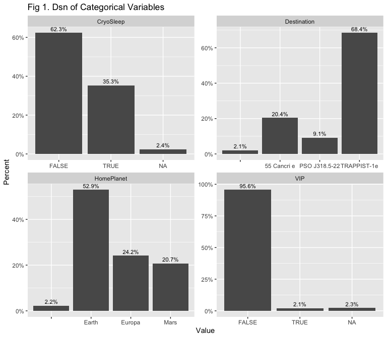
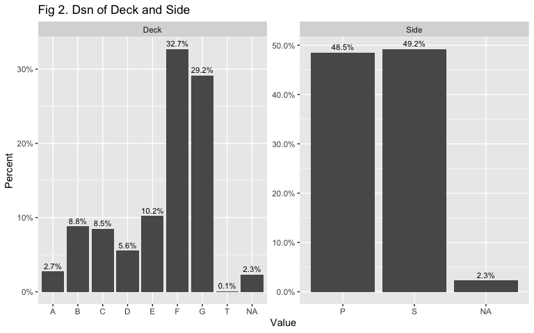
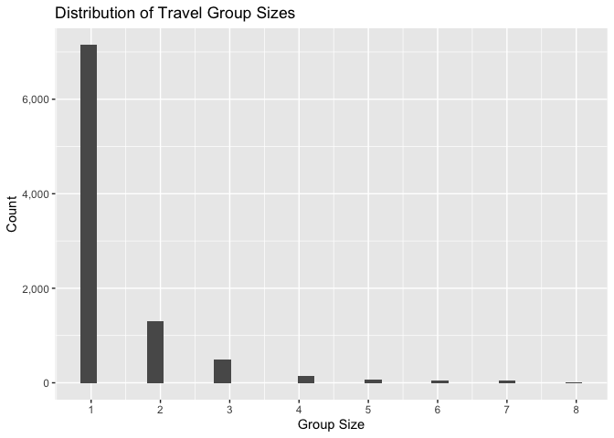

The Spaceship Titanic Incident
================
Darren Wong
2022-04-01

# Introduction

This is my first Kaggle submission, as well as one of my first forays
into machine learning. In this report I’ll be tackling the binary
classification problem of determining whether a passenger on the
Spaceship Titanic has been inadvertently and unfortunately teleported to
an alternate dimension. This write-up will be structured in the
following general way:

-   Exploratory data analysis (EDA)
-   Feature importance using mutual information and weight of
    information/information value
-   Imputation and prediction of missing values using the `mice` package
-   Model training and validation using random forests
-   Final prediction for the test set provided by Kaggle

Before we begin, some links and setup code:

-   This write-up is inspired by the excellent report written by
    Megan L. Risdal: [Exploring Survival on the
    Titanic](https://www.kaggle.com/code/mrisdal/exploring-survival-on-the-titanic/report)
-   [Kaggle competition
    link](https://www.kaggle.com/competitions/spaceship-titanic/overview)

``` r
library(tidyverse)    # Data manipulation and cleaning
library(data.table)   # Same as above & utilities for loading/saving csvs
library(ggplot2)      # Charting
library(scales)       # Prettier printing of values in charts
library(gridExtra)    # Arrange multiple ggplot2 plots on one chart
library(infotheo)     # Mutual information
library(Information)  # Weight of evidence/information value
library(mice)         # Missing value prediction
library(randomForest) # Random forests
library(caret)        # Confusion matrices

# Set working directory
setwd('~/Documents/Projects/kaggle/spaceship-titanic')
```

We can now load the data-sets that Kaggle provides us and then bind them
together.

``` r
train <- fread('raw-data/train.csv') %>% as_tibble()
test  <- fread('raw-data/test.csv') %>% as_tibble()

all   <- bind_rows(
  train %>% mutate(dataset = 'train'),
  test %>% mutate(dataset = 'test')
) 
```

# Exploratory Data Analysis

Some quick glimpses at the data to get a sense of what we’re working
with:

``` r
# We have 15 variables and 12,970 observations
glimpse(all)
```

    ## Rows: 12,970
    ## Columns: 15
    ## $ PassengerId  <chr> "0001_01", "0002_01", "0003_01", "0003_02", "0004_01", "0…
    ## $ HomePlanet   <chr> "Europa", "Earth", "Europa", "Europa", "Earth", "Earth", …
    ## $ CryoSleep    <lgl> FALSE, FALSE, FALSE, FALSE, FALSE, FALSE, FALSE, TRUE, FA…
    ## $ Cabin        <chr> "B/0/P", "F/0/S", "A/0/S", "A/0/S", "F/1/S", "F/0/P", "F/…
    ## $ Destination  <chr> "TRAPPIST-1e", "TRAPPIST-1e", "TRAPPIST-1e", "TRAPPIST-1e…
    ## $ Age          <dbl> 39, 24, 58, 33, 16, 44, 26, 28, 35, 14, 34, 45, 32, 48, 2…
    ## $ VIP          <lgl> FALSE, FALSE, TRUE, FALSE, FALSE, FALSE, FALSE, FALSE, FA…
    ## $ RoomService  <dbl> 0, 109, 43, 0, 303, 0, 42, 0, 0, 0, 0, 39, 73, 719, 8, 32…
    ## $ FoodCourt    <dbl> 0, 9, 3576, 1283, 70, 483, 1539, 0, 785, 0, 0, 7295, 0, 1…
    ## $ ShoppingMall <dbl> 0, 25, 0, 371, 151, 0, 3, 0, 17, 0, NA, 589, 1123, 65, 12…
    ## $ Spa          <dbl> 0, 549, 6715, 3329, 565, 291, 0, 0, 216, 0, 0, 110, 0, 0,…
    ## $ VRDeck       <dbl> 0, 44, 49, 193, 2, 0, 0, NA, 0, 0, 0, 124, 113, 24, 7, 0,…
    ## $ Name         <chr> "Maham Ofracculy", "Juanna Vines", "Altark Susent", "Sola…
    ## $ Transported  <lgl> FALSE, TRUE, FALSE, FALSE, TRUE, TRUE, TRUE, TRUE, TRUE, …
    ## $ dataset      <chr> "train", "train", "train", "train", "train", "train", "tr…

``` r
# View cardinality of variables
all %>% 
  select(-dataset) %>% 
  sapply(n_distinct)
```

    ##  PassengerId   HomePlanet    CryoSleep        Cabin  Destination          Age 
    ##        12970            4            3         9826            4           81 
    ##          VIP  RoomService    FoodCourt ShoppingMall          Spa       VRDeck 
    ##            3         1579         1954         1368         1680         1643 
    ##         Name  Transported 
    ##        12630            3

For completeness, I’ll include the data explanations provided by Kaggle
here:

| Variable                                          | Description                                                                                                                                               |
|---------------------------------------------------|-----------------------------------------------------------------------------------------------------------------------------------------------------------|
| PassengerId                                       | Unique ID for each passenger, in the format `gggg_pp` where `gggg` represents the travelling group and `pp` is the number of the individual in the group. |
| HomePlanet                                        | The planet the passenger departed from.                                                                                                                   |
| CryoSleep                                         | Whether the passenger chose to be put into cryosleep over the voyage. Passengers in cryosleep are confined to their cabins.                               |
| Cabin                                             | The cabin number where the passenger is staying. Takes the form `deck/num/side`, where `side` can be either `P` for Port or `S` for Starboard.            |
| Destination                                       | The planet the individual is travelling to.                                                                                                               |
| Age                                               | The age of the passenger.                                                                                                                                 |
| VIP                                               | Whether the passenger has paid for special VIP service during the voyage.                                                                                 |
| RoomService, FoodCourt, ShoppingMall, Spa, VRDeck | Amount the passenger has billed at each of the *Spaceship Titanic*’s many luxury amenities.                                                               |
| Name                                              | The first and last names of the passenger.                                                                                                                |
| Transported                                       | Whether the passenger was transported to another dimension, the target column.                                                                            |

Already we see some features that are candidates for one form of
engineering or another:

-   `PassengerId` has travel group information in it
-   `Cabin` can be split into deck, room number, and side which may be
    useful variables

We’ll now split the EDA work into categorical variables and numeric
variables.

## Categorical variables & booleans

Let’s first view the distinct value sets and their distributions for the
cardinality categorical variables.

``` r
all %>% 
  # Variables of interest
  select(HomePlanet, Destination, CryoSleep, VIP) %>% 
  gather(variable, value) %>% 
  # Calculating percentage distributions for each value
  group_by(variable, value) %>% 
  summarise(
    n = n(),
    .groups = 'drop'
  ) %>% 
  group_by(variable) %>% 
  mutate(percentage = n / sum(n)) %>% 
  ungroup() %>% 
  # Charting
  ggplot(aes(x = value, y = percentage, label = percent(percentage, accuracy = 0.1))) +
  geom_col() +
  facet_wrap(vars(variable), scales = 'free') +
  # Label formatting
  labs(x = 'Value', y = 'Percent', title = 'Fig 1. Dsn of Categorical Variables') +
  geom_text(
    position = position_dodge(width = .9),
    vjust = -0.5,
    size = 3
  ) + 
  scale_y_continuous(labels = percent)
```



Some takeaways from this chart:

-   Missing values seem to take the form of empty strings for
    Destination & HomePlanet;
-   We’ll want to be careful with the VIP variable since they make up
    such a small percentage of total passengers;
-   62.3% of passengers opted to not be put into cryosleep; and,
-   The majority of passengers have Earth as their home planet, and the
    majority of passengers are travelling to TRAPPIST-1e.

To round this off, lets use some frequency tables to see how the rate of
inadvertent transportation to an alternate dimension varies within each
of these variables.

**HomePlanet vs. Transported**

``` r
#  People from Europa seem to be transported at a higher frequency than people from other planets
#  People from Earth seem to be transported at a lower frequency
table(train$HomePlanet, train$Transported) %>% prop.table(1)
```

    ##         
    ##              FALSE      TRUE
    ##          0.4875622 0.5124378
    ##   Earth  0.5760539 0.4239461
    ##   Europa 0.3411544 0.6588456
    ##   Mars   0.4769756 0.5230244

It appears that people from Europa are transported at a higher
frequency, while people from Earth seem to be transported at a lower
frequency.

**Destination vs. Transported**

``` r
table(train$Destination, train$Transported) %>% prop.table(1)
```

    ##                
    ##                     FALSE      TRUE
    ##                 0.4945055 0.5054945
    ##   55 Cancri e   0.3900000 0.6100000
    ##   PSO J318.5-22 0.4962312 0.5037688
    ##   TRAPPIST-1e   0.5288250 0.4711750

People headed to 55 Cancri e seem to be transported at a higher
frequency than the other destinations.

**CryoSleep vs. Transported**

``` r
table(train$CryoSleep, train$Transported) %>% prop.table(1)
```

    ##        
    ##             FALSE      TRUE
    ##   FALSE 0.6710792 0.3289208
    ##   TRUE  0.1824169 0.8175831

People in `CryoSleep` seem to be transported at a higher frequency than
not.

**VIP vs. Transported**

``` r
table(train$VIP, train$Transported) %>% prop.table(1)
```

    ##        
    ##             FALSE      TRUE
    ##   FALSE 0.4936678 0.5063322
    ##   TRUE  0.6180905 0.3819095

People in VIP tend to be transported less, however be wary of this
variable as there is only very small percentage of passengers are VIPs.

### Deeper dive into `Cabin`

Let’s have a closer look at the `Cabin` variable, and the three
substituent pieces of information it provides. First we’ll split the
`Cabin` variable into `Deck`, `Num` (room number), and `Side`, then
we’ll view the distributions of the categorical information provided by
`Deck` and `Side`.

``` r
all_cabin_spl <- all %>% 
  mutate(Cabin = na_if(Cabin, "")) %>% 
  separate(Cabin, c("Deck", "Num", "Side"), "/")

all_cabin_spl %>% 
  # Variables of interest
  select(Deck, Side) %>% 
  gather(variable, value) %>% 
  # Calculating percentage distributions for each value
  group_by(variable, value) %>% 
  summarise(
    n = n(),
    .groups = 'drop'
  ) %>% 
  group_by(variable) %>% 
  mutate(percentage = n / sum(n)) %>% 
  ungroup() %>% 
  # Charting
  ggplot(aes(x = value, y = percentage, label = percent(percentage, accuracy = 0.1))) +
  geom_col() +
  facet_wrap(vars(variable), scales = 'free') +
  # Label formatting
  labs(x = 'Value', y = 'Percent', title = 'Fig 2. Dsn of Deck and Side') +
  geom_text(
    position = position_dodge(width = .9),
    vjust = -0.5,
    size = 3
  ) + 
  scale_y_continuous(labels = percent)
```



At a glance, passengers tend to be more heavily weighted towards decks F
and G, with a very small allocation to deck T. The distribution between
port and starboard sides seems to be around equal.

Let’s quickly check how the rate of transportation to an alternative
dimension varies with these features:

**Deck vs. Transported**

``` r
# Pull only examples from the training dataset as these have non-NA Transported values
train_cabin_spl <- all_cabin_spl %>% filter(dataset == 'train') %>% select(-dataset)

table(train_cabin_spl$Deck, train_cabin_spl$Transported) %>% prop.table(1)
```

    ##    
    ##         FALSE      TRUE
    ##   A 0.5039062 0.4960938
    ##   B 0.2657253 0.7342747
    ##   C 0.3199465 0.6800535
    ##   D 0.5669456 0.4330544
    ##   E 0.6426941 0.3573059
    ##   F 0.5601288 0.4398712
    ##   G 0.4837827 0.5162173
    ##   T 0.8000000 0.2000000

Passengers on decks B, C, E, T all seem to be transported at a varying
rate.

**Side vs. Transported**

``` r
table(train_cabin_spl$Side, train_cabin_spl$Transported) %>% prop.table(1)
```

    ##    
    ##         FALSE      TRUE
    ##   P 0.5487399 0.4512601
    ##   S 0.4449627 0.5550373

Doesn’t look like transportation rate varies much with what side the
passenger was on.

### Deeper dive into `PassengerId`

Let’s see if the traveller’s group size will be helpful for our
purposes, first we’ll see what the distribution of group sizes looks
like.

``` r
# Separate the PassengerId variable into a Group and Passenger ID.
all_grp_sep <- all %>% 
  separate(PassengerId, c('GroupId', 'PassengerId'), "_")

# Get number of individuals within each group ID.
all_grps <- all_grp_sep %>% 
  distinct(GroupId, PassengerId) %>% 
  group_by(GroupId) %>% 
  summarise(
    group_size = n(), 
    .groups = 'drop'
  )

# View distribution of group sizes
all_grps %>% 
  ggplot(aes(x = group_size)) +
  geom_histogram() +
  scale_x_continuous(breaks = unique(all_grps$group_size) %>% sort()) +
  scale_y_continuous(labels = comma) +
  labs(x = 'Group Size', y = "Count", title = "Distribution of Travel Group Sizes")
```

    ## `stat_bin()` using `bins = 30`. Pick better value with `binwidth`.

<!-- -->

To round this out, we’ll have a quick look at how alternate dimension
transportation varies across group sizes.

``` r
# Add the new group size variable onto the main dataset then filter only for the training set
all_grouped <- all_grp_sep %>% left_join(all_grps, by = 'GroupId')

train_grouped <- all_grouped %>% filter(dataset == 'train') %>% select(-dataset)

table(train_grouped$group_size, train_grouped$Transported) %>% prop.table(1)
```

    ##    
    ##         FALSE      TRUE
    ##   1 0.5475546 0.4524454
    ##   2 0.4619501 0.5380499
    ##   3 0.4068627 0.5931373
    ##   4 0.3592233 0.6407767
    ##   5 0.4075472 0.5924528
    ##   6 0.3850575 0.6149425
    ##   7 0.4588745 0.5411255
    ##   8 0.6057692 0.3942308

It looks like transportation rate varies a little bit with group size.

That’s it for the categorical variables, we’ll move on to the numerical
variables now. *Note to self*: We may be able to infer with questionable
success the gender of each individual which may be a useful feature.

## Numerical variables

The following are the numeric variables available to us as well as their
quartiles and number of NAs present.

``` r
# All stock features
all %>% 
  select(-dataset) %>% 
  select_if(is.numeric) %>% 
  summary()
```

    ##       Age         RoomService        FoodCourt      ShoppingMall    
    ##  Min.   : 0.00   Min.   :    0.0   Min.   :    0   Min.   :    0.0  
    ##  1st Qu.:19.00   1st Qu.:    0.0   1st Qu.:    0   1st Qu.:    0.0  
    ##  Median :27.00   Median :    0.0   Median :    0   Median :    0.0  
    ##  Mean   :28.77   Mean   :  222.9   Mean   :  452   Mean   :  174.9  
    ##  3rd Qu.:38.00   3rd Qu.:   49.0   3rd Qu.:   77   3rd Qu.:   29.0  
    ##  Max.   :79.00   Max.   :14327.0   Max.   :29813   Max.   :23492.0  
    ##  NA's   :270     NA's   :263       NA's   :289     NA's   :306      
    ##       Spa              VRDeck       
    ##  Min.   :    0.0   Min.   :    0.0  
    ##  1st Qu.:    0.0   1st Qu.:    0.0  
    ##  Median :    0.0   Median :    0.0  
    ##  Mean   :  308.5   Mean   :  306.8  
    ##  3rd Qu.:   57.0   3rd Qu.:   42.0  
    ##  Max.   :22408.0   Max.   :24133.0  
    ##  NA's   :284       NA's   :268

``` r
# + the room number of the passenger
all_cabin_spl %>% 
  select(Num) %>% 
  mutate(Num = as.numeric(Num)) %>% 
  summary()
```

    ##       Num        
    ##  Min.   :   0.0  
    ##  1st Qu.: 170.0  
    ##  Median : 431.0  
    ##  Mean   : 603.6  
    ##  3rd Qu.:1008.0  
    ##  Max.   :1894.0  
    ##  NA's   :299
